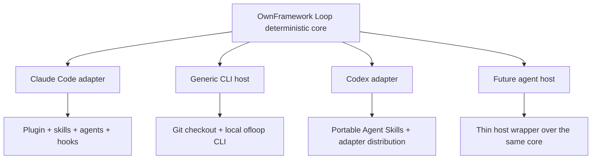

# OwnFramework Loop

> Human-gated engineering protocol for AI coding agents.

OwnFramework Loop binds engineering work to a human-approved work packet, lets a coding agent build inside bounded scope, reviews the exact resulting Git commit, limits repair cycles, and leaves merge/deployment authority with the human.

**Born on Claude Code. Not locked to Claude Code.**

The project was developed around a Claude Code loop workflow and remains optimized for Claude's native plugin, skills, agents, hooks, and command-interception model. The deterministic protocol itself is vendor-neutral: any coding-agent host that can operate in a Git checkout and invoke local `ofloop` commands can participate without creating a second state machine.

## Why it exists

Coding agents are good at implementation. Long engineering missions still need an explicit answer to a different set of questions:

- What exact work did the human approve?
- What scope and risk budget apply?
- What immutable candidate did the builder produce?
- Did the reviewer inspect that exact candidate SHA?
- How many repair rounds are allowed?
- Is the result merely reviewed, or actually promoted?

OwnFramework Loop makes those boundaries explicit and machine-readable.

```text
mission
  ↓
work packet
  ↓
human approval + packet hash binding
  ↓
bounded builder
  ↓
exact candidate Git SHA
  ↓
exact-SHA reviewer
  ↓
APPROVED / CHANGES_REQUESTED / BLOCKED / STOPPED
  ↓
human promotion outside the loop
```

The loop never treats an `APPROVED` verdict as permission to push, merge, deploy, publish, or perform another external action.

## Compatibility model

OwnFramework Loop separates **protocol compatibility** from **host-native UX**.



There are three compatibility layers:

1. **Deterministic protocol core** — the portability floor. A host only needs to work in Git and invoke local `ofloop` commands.
2. **Portable Agent Skills** — optional `SKILL.md` wrappers for hosts that understand the Agent Skills format.
3. **Native adapters** — host-specific plugins, commands, hooks, subagents, installers, or loop integrations when the host genuinely supports them.

Native capabilities can make an adapter easier to use or more hardened. They do not get their own approval/state/SHA/verdict machinery.

See [`docs/architecture/PORTABILITY_MODEL.md`](docs/architecture/PORTABILITY_MODEL.md).

## Agent support

| Agent host | Status | What is supported |
|---|---|---|
| **Claude Code** | **Stable / reference** | Managed plugin, `/of-loop:spec`, `/of-loop:build`, `/of-loop:review`, custom agents, native hooks, direct `--plugin-dir` evaluation |
| **Generic CLI host** | **Portable baseline** | Any coding-agent host that can operate a Git checkout, invoke local `ofloop`, produce a candidate commit, and review an exact SHA |
| **Codex** | **Experimental** | Opt-in adapter installer, portable Agent Skills, repository `AGENTS.md`, and the same deterministic core; authenticated live lifecycle proof is still pending |

Agent-agnostic does **not** mean every host has identical enforcement. See [`docs/architecture/CAPABILITY_MATRIX.md`](docs/architecture/CAPABILITY_MATRIX.md) for the distinction between protocol compatibility and hardened host integration.

## Claude Code quickstart

Claude Code remains the simplest and most complete way to use OwnFramework Loop.

### Persistent install

```bash
git clone https://github.com/william-london/ownframework-loop.git
cd ownframework-loop
bash install.sh
```

Verify:

```bash
claude plugin list
```

You should see `of-loop@ownframework` with the current release version.
The version is derived from the source tree at install — there is no
hardcoded version in the install proof.

Then open Claude in the repository you want to work on:

```bash
cd /path/to/your-target-repository
claude
```

The stable Claude commands remain:

```text
/of-loop:spec <mission>
/of-loop:spec approve <run-id>
/of-loop:build <run-id>
/of-loop:review <run-id>
```

`/of-loop:spec approve` only surfaces the operator command; the model does not perform approval. The human executes `ofloop spec approve <repo> <run-id>` from an interactive terminal.

### Session-local Claude evaluation

To try the plugin without installing it:

```bash
git clone https://github.com/william-london/ownframework-loop.git /path/to/ownframework-loop
cd /path/to/your-target-repository
claude --plugin-dir /path/to/ownframework-loop
```

`--plugin-dir` is session-local. If you exit and start a new Claude session, launch again with the flag. A plain later `claude` launch automatically includes OwnFramework Loop only after the persistent install path.

## Bring your own agent

A vendor-specific plugin is **not** required.

Use the generic portability layer when your coding agent can:

- read and modify a Git checkout;
- invoke local shell/CLI commands;
- commit a bounded candidate;
- inspect an exact Git SHA;
- return structured build/review results through the supported core path.

From an OwnFramework Loop checkout:

```bash
./bin/ofloop adapter show generic-cli
./bin/ofloop adapter doctor generic-cli
```

If your host understands Agent Skills, point it at:

```text
.agents/skills/of-loop-spec/
.agents/skills/of-loop-build/
.agents/skills/of-loop-review/
.agents/skills/of-loop-status/
```

If it does **not** support Agent Skills, use [`adapters/generic-cli/README.md`](adapters/generic-cli/README.md) plus those skill files as the semantic reference for a thin wrapper or instruction surface.

The rule is simple:

> Adapt the host to OwnFramework Loop. Do not fork OwnFramework Loop into a host-specific state machine.

That means a future Cursor, Copilot, Gemini, OpenCode, local-model, editor, terminal, or other coding-agent integration can reuse the same packet, approval, state, candidate-SHA, verdict, repair, and promotion contract without requiring the core to know that vendor exists.

This is an architectural compatibility path, not a claim that every named product has already been live-tested.

## Portable Agent Skills

The host-neutral skill descriptions live under:

```text
.agents/skills/of-loop-spec/
.agents/skills/of-loop-build/
.agents/skills/of-loop-review/
.agents/skills/of-loop-status/
```

They describe how an agent participates in the same protocol while delegating approval, lifecycle transitions, candidate identity, verdict identity, and repair accounting to `ofloop`.

The existing Claude plugin skills under `skills/` remain first-class and may use Claude-specific extensions. Portability is additive; it is not a lowest-common-denominator rewrite of the Claude adapter.

## Experimental Codex quickstart

Codex uses a separate opt-in adapter path so Claude users do not inherit provider-selection or configuration steps.

From a clone of this repository:

```bash
bash install-adapter.sh codex
```

By default this installs:

- the exact committed OwnFramework Loop core under user-local data;
- a managed `ofloop` launcher under `~/.local/bin`;
- `of-loop-spec`, `of-loop-build`, `of-loop-review`, and `of-loop-status` under `~/.agents/skills`.

The installer refuses unmanaged conflicts instead of overwriting them. Remove the adapter with:

```bash
bash uninstall-adapter.sh codex
```

Restart Codex after installation so skill discovery can refresh.

Inspect the installed adapter contract:

```bash
ofloop adapter show codex
ofloop adapter doctor codex --allow-unverified
```

If `~/.local/bin` is not already on your `PATH`, use the path printed by the installer or add it to your shell configuration.

Codex remains **experimental** and `live_verified=false` until a real authenticated Codex environment proves skill discovery and a disposable spec/build/review lifecycle. GitHub Actions currently proves the current Codex CLI installs, the adapter distribution installs/uninstalls cleanly, and the portable files conform to the same deterministic core contract; that is not presented as equivalent to live agent-host proof.

See [`adapters/codex/README.md`](adapters/codex/README.md) for the current boundary.

## Why not just run an agent in a loop?

A plain loop can repeatedly ask a model to keep working. OwnFramework Loop focuses on **governance of the engineering transaction**.

| Plain agent loop | OwnFramework Loop |
|---|---|
| Repeats until prompt/model decides to stop | Uses bounded lifecycle and repair limits |
| Scope often lives mainly in prompt text | Scope is bound to an approved work packet |
| Reviews whatever state is currently visible | Reviewer is bound to an exact candidate Git SHA |
| Builder/reviewer authority may blur | Roles hand off through deterministic state |
| “Looks good” may flow directly into action | `APPROVED` still stops before human promotion |
| Usually tied to one host's orchestration model | Core protocol remains independent of the host |

OwnFramework Loop can coexist with methodologies, skill collections, and native agent loops. Those systems can decide **how** to engineer; OwnFramework Loop governs **what was authorized, what artifact was produced, what exact artifact was reviewed, how repairs are bounded, and whether it is eligible for human promotion**.

## Architecture

The dependency direction is intentional:

```text
agent host / native adapter
          ↓
portable SPEC / BUILD / REVIEW / STATUS semantics
          ↓
       ofloop CLI
          ↓
deterministic protocol/core
          ↓
packet + approval + state + Git SHA + verdict + repair budget
```

The core owns:

- work-packet validation;
- interactive approval and packet-hash binding;
- deterministic lifecycle transitions;
- locks and bounded budgets;
- isolated worktree/candidate handling;
- exact candidate Git SHA;
- exact-SHA review/verdict binding;
- repair accounting and terminal semantics;
- the boundary before human promotion.

Adapters own host-specific discovery, skills, agents, hooks, installers, and UX. They do not get a parallel state machine.

Start with:

- [`docs/architecture/CORE_INVARIANTS.md`](docs/architecture/CORE_INVARIANTS.md)
- [`docs/architecture/ADAPTER_CONTRACT.md`](docs/architecture/ADAPTER_CONTRACT.md)
- [`docs/architecture/PORTABILITY_MODEL.md`](docs/architecture/PORTABILITY_MODEL.md)
- [`docs/architecture/CAPABILITY_MATRIX.md`](docs/architecture/CAPABILITY_MATRIX.md)
- [`docs/architecture/AGENT_SKILLS.md`](docs/architecture/AGENT_SKILLS.md)
- [`docs/ADAPTER_DEVELOPMENT.md`](docs/ADAPTER_DEVELOPMENT.md)

## Core invariants

1. Approval is a human-operated boundary. The portable core requires interactive confirmation; hardened adapters additionally withhold the approval command from the agent tool surface.
2. Approval binds the exact work-packet bytes/hash.
3. Builders operate inside approved scope and budgets.
4. Candidate identity is an exact Git SHA.
5. Review binds to that exact SHA—not an arbitrary current worktree.
6. State transitions are serialized and deterministic.
7. Repair cycles are bounded.
8. Terminal states fail closed.
9. The loop does not gain push, merge, deploy, publish, send, payment, or unrelated remote authority.
10. Human promotion remains outside the loop.

## Adapter inspection

The deterministic adapter CLI does not launch providers or store credentials:

```bash
./bin/ofloop adapter list
./bin/ofloop adapter show claude-code
./bin/ofloop adapter doctor claude-code
./bin/ofloop adapter show generic-cli
./bin/ofloop adapter doctor generic-cli
./bin/ofloop adapter show codex
```

## Validation

Canonical source validation:

```bash
./validate.sh
./release_gate.sh
```

Stable release markers include:

```text
OF_LOOP_FAILED=0
OF_LOOP_RELEASE_GATE_RESULT=PASS
RELEASE_GATE=PASS
```

Adapter-specific conformance:

```bash
bash tests/run_adapter_conformance.sh
bash tests/integration/test_adapter_portability.sh
bash tests/integration/test_adapter_cli.sh
bash tests/integration/test_codex_adapter_install.sh
```

GitHub Actions runs the generic integration matrix on Linux and macOS with supported Python versions, the full release gate on dedicated Ubuntu jobs, a real Claude plugin distribution proof, and a current Codex CLI/static distribution proof. Real authenticated named-host lifecycle proofs remain separate when they require an existing account session.

## Requirements

Core/runtime:

- Python 3.12+
- Git
- Bash / POSIX-style environment
- macOS or Linux for the current lock/worktree/runtime implementation

Claude reference adapter:

- Claude Code 2.1+ for the currently documented plugin workflow

Codex is required only when evaluating the experimental Codex adapter.

## Project status

Current release line: **0.4.4** (canonical sources: `.claude-plugin/plugin.json` `version` and `lib/ownframework_loop/__init__.py` `__version__`).

v0.4.0 introduced the agent-neutral core/adapter contract with Claude Code as the stable reference adapter and Codex as an experimental named adapter.

v0.4.1 adds a vendor-neutral `generic-cli` portability baseline so future coding-agent hosts can integrate through the same deterministic core even without native Agent Skills or a plugin system.

This is still an early public project. Real-repository effectiveness depends on the task, repository, agent host, environment, and validation supplied by the operator.

See [`CHANGELOG.md`](CHANGELOG.md) for release history.

## Contributing

Contributions are welcome. See [`CONTRIBUTING.md`](CONTRIBUTING.md). Adapter contributors should also read [`docs/ADAPTER_DEVELOPMENT.md`](docs/ADAPTER_DEVELOPMENT.md).

If you use another coding agent and want first-class integration, an adapter proposal is useful even before code exists. Start from the generic portability floor and document what native capability your host can add.

## Security

See [`SECURITY.md`](SECURITY.md) for the supported release posture and responsible disclosure path.

## License

Apache License 2.0. See [`LICENSE`](LICENSE) and [`THIRD_PARTY_NOTICES.md`](THIRD_PARTY_NOTICES.md).
